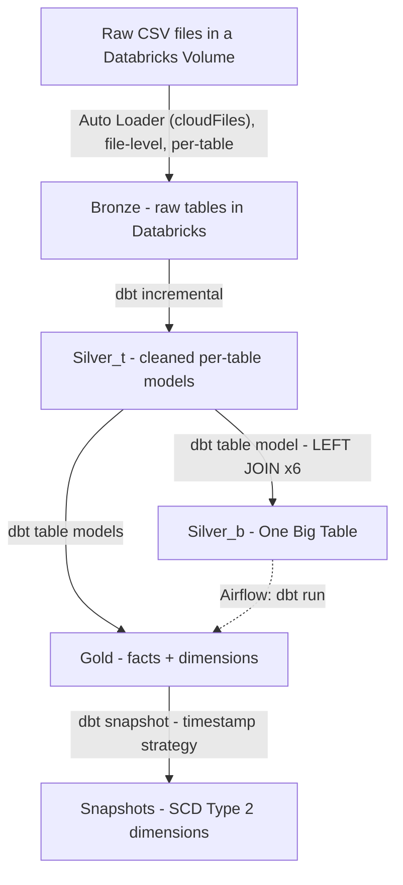

# Walmart End-to-End Data Pipeline

An end-to-end ELT pipeline that ingests a Walmart retail dataset (a static CSV snapshot stored in a Databricks Volume — see [Source](#source-csv-in-volume)) into Databricks, transforms it through a Bronze → Silver → Gold lakehouse architecture with **dbt**, orchestrates everything with **Airflow**, and models SCD Type 2 history for the core dimensions.

> Built as a learning project following an online course, but with several deliberate design changes (see [Design Decisions](#design-decisions)).

---

## Tech Stack

| Layer           | Tool                                                                        |
| --------------- | --------------------------------------------------------------------------- |
| Source          | Static CSV snapshot of the Walmart dataset, uploaded to a Databricks Volume |
| Ingestion       | Per-table **Auto Loader** (`cloudFiles`) streams, file-level incremental, parameterized via Databricks widgets |
| Lakehouse       | **Databricks** (Unity Catalog: `bronze` / `silver_t` / `silver_b` / `gold`) |
| Transformation  | **dbt** (incremental models, OBT, snapshots, tests)                         |
| Orchestration   | **Apache Airflow** (Docker Compose, Databricks SDK)                         |
| Data quality    | dbt tests (`unique`, `not_null`, `relationships`, `dbt_utils`)              |

---

## Architecture



**Flow summary**

1. **Source** — a static CSV snapshot of the Walmart dataset
   (`orders`, `customers`, `products`, `order_items`, `stores`, `employees`),
   uploaded to a raw Volume. Each row still carries `updated_timestamp` and
   `created_timestamp` fields baked into the CSV itself, which is what makes
   row-level CDC possible downstream in Silver.
2. **Bronze** — A per-table Auto Loader (`cloudFiles`) stream, driven by a
   parameterized notebook (`dbutils.widgets`), ingests new files
   from the raw Volume into `bronze.*`. See
   [Bronze Ingestion](#bronze-ingestion-auto-loader-file-level-incremental) below —
   this is **file-level** incrementality, distinct from the row-level CDC that
   happens one layer up, in Silver.
3. **Silver_t** — One dbt **incremental model per table**, using
   `is_incremental()` + `updated_timestamp` as the cursor column.
4. **Silver_b** — A single **One Big Table (OBT)**, built by `LEFT JOIN`-ing
   all six `silver_t` tables around `orders`.
5. **Gold** —
   - **Facts** (`fact_order_items`) are built **directly from
     `silver_t`**, not from the OBT, to avoid inheriting the order → order_items
     row explosion.
   - **Dimensions** (`dim_customers`, `dim_products`, `dim_stores`,
     `dim_employees`) are also built from `silver_t`, each deduplicated with:

     ```sql
     qualify row_number() over (
       partition by <pk> order by updated_timestamp desc
     ) = 1
     ```

     See [Gold Dimensions: SCD1, Incrementally](#gold-dimensions-scd1-incrementally)
     for why these are `incremental` (not `table`) and what "SCD1" means here.
6. **Snapshots** — The four dimension tables each have a dbt **snapshot**
   (SCD Type 2, `timestamp` strategy). Fact tables are intentionally **not**
   snapshotted — they represent immutable business events. See
   [SCD1 Gold vs. SCD2 Snapshots](#scd1-gold-vs-scd2-snapshots-why-both) for why
   both exist side by side.

---

## Project Structure

```
walmart_proj/
├── models/
│   ├── source/          # source table definitions
│   ├── silver_t/        # per-table incremental models
│   ├── silver_b/        # OBT (one big table), joined from silver_t
│   └── gold/            # fact + dimension tables
├── snapshots/           # SCD2 snapshots for the 4 dimension tables
├── tests/               # singular / custom data quality tests
├── macros/
├── airflow/
│   └── dags/
│       └── orchestrate.py
├── dbt_project.yml
├── packages.yml
└── README.md
```

---

## Quickstart

### Prerequisites

- Docker + Docker Compose
- A Databricks workspace with:
  - A SQL warehouse or cluster
  - A Job that ingests the raw Volume → Bronze
- Python 3.10+ (only if running dbt locally)

### 1. Clone & configure

```bash
git clone <your-repo-url>
cd walmart_proj
cp .env.example .env
```

`.env` (never commit this):

```env
DATABRICKS_HOST=https://<your-workspace>.cloud.databricks.com
DATABRICKS_TOKEN=dapiXXXXXXXXXXXXXXXXXXXX
DATABRICKS_JOB_ID=123456789
DATABRICKS_HTTP_PATH=/sql/1.0/warehouses/xxxxxxxx
```

dbt profile (`~/.dbt/profiles.yml`):

```yaml
walmart_proj:
  target: dev
  outputs:
    dev:
      type: databricks
      catalog: walmart
      schema: gold
      host: "{{ env_var('DATABRICKS_HOST') }}"
      http_path: "{{ env_var('DATABRICKS_HTTP_PATH') }}"
      token: "{{ env_var('DATABRICKS_TOKEN') }}"
```

### 2. Run the full pipeline via Airflow

```bash
cd airflow
docker compose up -d
# Airflow UI: http://localhost:8080  (airflow / airflow)
```

Trigger the DAG `orchestrate` from the UI, or via CLI:

```bash
docker compose exec airflow-scheduler \
  airflow dags trigger orchestrate
```

### 3. Run dbt manually (optional)

```bash
dbt deps
dbt source freshness
dbt run  --select silver_t
dbt test --select silver_t
dbt run  --select silver_b
dbt test --select silver_b
dbt run  --select gold
dbt snapshot
dbt run  --select gold/fact
```

---

## Bronze Ingestion: Auto Loader (file-level incremental)

Each source table is loaded into Bronze by the **same notebook, parameterized**
by table name via a Databricks widget, rather than six separate hardcoded
notebooks:

```python
dbutils.widgets.text("table_name", "", "Table Name")
table_name = dbutils.widgets.get("table_name").strip()

print(f"=== Running Bronze ingestion stream for table: {table_name} ===")

df = spark.readStream.format("cloudFiles") \
    .option("cloudFiles.format", "csv") \
    .option("cloudFiles.schemaLocation", f"/Volumes/walmart/bronze/bronzevolume/{table_name}/checkpoint") \
    .option("cloudFiles.schemaEvolutionMode", "rescue") \
    .load(f"/Volumes/walmart/raw/rawvolume/{table_name}/")

query = df.writeStream.format("delta") \
    .outputMode("append") \
    .trigger(once=True) \
    .option("checkpointLocation", f"/Volumes/walmart/bronze/bronzevolume/{table_name}/checkpoint") \
    .toTable(f"walmart.bronze.{table_name}")

query.awaitTermination()

prog = query.lastProgress
print(f"✅ batchId      : {prog.get('batchId') if prog else None}")

# Table's total row count after this run
total = spark.sql(f"SELECT COUNT(*) FROM walmart.bronze.{table_name}").collect()[0][0]
print(f"✅ Total rows in table : {total}")

# Rows written by this specific run, from Delta's own commit history
hist = spark.sql(f"DESCRIBE HISTORY walmart.bronze.{table_name} LIMIT 1").collect()[0]
metrics = hist["operationMetrics"] or {}
print(f"✅ Rows written this run : {metrics.get('numOutputRows', 'N/A')}")
print(f"✅ operation            : {hist['operation']}")
```

Currently this notebook is run **manually, six times** — the `table_name`
widget value is changed by hand and the notebook re-run for each of
`orders`, `customers`, `products`, `order_items`, `stores`, `employees`. This
is a known gap: the natural next step is a Databricks Job with a `for_each`
task (looping the same notebook task over the six table names automatically)
rather than six manual re-runs — not yet implemented in this project.

**This is file-level incrementality, not row-level CDC.** Auto Loader's
`checkpointLocation` tracks which *files* under
`/Volumes/walmart/raw/rawvolume/{table_name}/` have already been ingested —
it has no awareness of the `updated_timestamp` column inside those files, and
it never deduplicates rows. If the same customer appears again in a later
file (e.g. an upstream full daily export), Bronze happily appends another
copy — Bronze is pure append-only history at the file level. The row-level
cursor (`updated_timestamp > max(updated_timestamp)`) only enters the
pipeline one layer up, in the `silver_t` incremental models, which is also
where the resulting duplicate rows finally get collapsed via
`qualify row_number() = 1`. Bronze's job is simply "don't re-read a file
you've already read"; Silver's job is "don't re-process a row you've
already seen, and only keep the latest version of each one."

> **Note on `.option("path", ...)`:** an earlier version of this script also
> passed `.option("path", f"/Volumes/.../{table_name}/data")` alongside
> `.toTable(...)`, intending to pin the table's storage location inside the
> Volume. On Databricks Free Edition this produced an intermittent
> `AnalysisException: Missing cloud file system scheme` — `toTable()` implies
> a UC-managed table, and giving it a `/Volumes/...` path (not a real cloud
> URI) confuses UC's temporary-credential generation for that path. Removing
> `.option("path", ...)` and letting `toTable()` fully manage storage resolved
> it. This doesn't affect incrementality — `checkpointLocation` is what drives
> incremental loading, not where the table's data physically lives.

### Verifying Bronze row counts across all six tables

```sql
select 'orders' as table_name, count(*) as row_count from walmart.bronze.orders
union all
select 'customers', count(*) from walmart.bronze.customers
union all
select 'products', count(*) from walmart.bronze.products
union all
select 'order_items', count(*) from walmart.bronze.order_items
union all
select 'stores', count(*) from walmart.bronze.stores
union all
select 'employees', count(*) from walmart.bronze.employees
order by table_name;
```

One query across all six Bronze tables, rather than checking each table
individually, to confirm every Auto Loader stream actually landed data
before trusting downstream Silver/Gold builds on top of it.

### Verifying Bronze idempotency

To confirm the Auto Loader streams are safe to re-run without duplicating
data, the same ingestion notebook was executed twice in a row for a given
`table_name`, with no new files added to the raw Volume between runs. The
`UNION ALL` row-count query above returned identical totals both times —
confirming `checkpointLocation` correctly recognized the files as already
processed on the second run and skipped them, rather than re-ingesting and
duplicating them.

---

## Orchestration (Airflow)

The `orchestrate` DAG chains the whole flow into one observable pipeline:

```
ingest_cdc
  → clean_target
  → source_freshness
  → silver_technical
  → silver_technical_tests
  → silver_business
  → silver_business_tests
  → gold
  → gold_dimensions
  → gold_facts
```

| Task                       | What it does                                                                                                                        |
| -------------------------- | ----------------------------------------------------------------------------------------------------------------------------------- |
| `ingest_cdc`               | Python `@task`: triggers the Databricks ingest Job via `WorkspaceClient.jobs.run_now()`, polls `get_run()` every 5s, raises on non-`SUCCESS`. |
| `clean_target`             | `@task.bash`: clears `target/` and `logs/` so stale compiled artifacts don't leak.                                                  |
| `source_freshness`         | `dbt source freshness` — fail fast if Bronze is stale.                                                                              |
| `silver_technical(_tests)` | `dbt run` + `dbt test` on `silver_t`.                                                                                               |
| `silver_business(_tests)`  | `dbt run` + `dbt test` on `silver_b` (OBT).                                                                                         |
| `gold`                     | `dbt run --select gold`.                                                                                                            |
| `gold_dimensions`          | `dbt snapshot` — SCD2 for the four dimensions.                                                                                      |
| `gold_facts`               | `dbt run --select gold/fact` — explicit final fact rebuild.                                                                         |

Tasks are chained with `>>` so a failure upstream (e.g. `source_freshness` or a
Silver test) **blocks everything downstream** — Gold is never built on stale or
broken Silver data.

<details>
<summary><b>Why the Databricks SDK instead of <code>DatabricksRunNowOperator</code>?</b></summary>

Both call the same Databricks Jobs API:

```python
# Option A — SDK (used here): explicit polling loop
from databricks.sdk import WorkspaceClient
from databricks.sdk.service.jobs import RunLifeCycleState, RunResultState

ws = WorkspaceClient(host=DATABRICKS_HOST, token=DATABRICKS_TOKEN)
run = ws.jobs.run_now(job_id=JOB_ID)
while True:
    state = ws.jobs.get_run(run.run_id).state
    if state.life_cycle_state in {
        RunLifeCycleState.TERMINATED,
        RunLifeCycleState.SKIPPED,
        RunLifeCycleState.INTERNAL_ERROR,
    }:
        if state.result_state == RunResultState.SUCCESS:
            break
        raise Exception(f"Job failed: {state.result_state}")
    time.sleep(5)
```

```python
# Option B — Airflow provider operator (not used): less code, less control
from airflow.providers.databricks.operators.databricks import DatabricksRunNowOperator

DatabricksRunNowOperator(
    task_id="trigger_ingest_walmart_job",
    databricks_conn_id="databricks_default",
    job_id=JOB_ID,
)
```

The SDK route was chosen for explicit control over the polling loop and failure
semantics. The operator route is simpler when you just want "trigger and wait."
Credentials are read from `DATABRICKS_HOST` / `DATABRICKS_TOKEN` env vars — never
hardcoded.

</details>

---

## Design Decisions

### Why Auto Loader instead of Lakeflow Connect for PostgreSQL?

The course this project follows connects to a Ghost-hosted PostgreSQL
instance and pulls rows directly via a database connection. That Ghost
instance is no longer available, so re-establishing a live PostgreSQL source
was not an option.

Databricks' managed ingestion path for operational databases is **Lakeflow
Connect**, which supports PostgreSQL via logical replication and CDC out of
the box. However, Lakeflow Connect requires a live, reachable PostgreSQL
source with `wal_level = logical`, a replication slot, and a publication
configured on the source side — none of which exist anymore, because the
source database itself is gone.

What this project actually has is a **static CSV snapshot** of the same
dataset, uploaded to a raw Volume. For file-based sources on cloud object
storage or Unity Catalog Volumes, **Auto Loader is the correct
Databricks-native ingestion tool** — Lakeflow Connect is built for SaaS apps
and operational databases, not files on object storage.

The choice isn't "Auto Loader over Lakeflow Connect" in the abstract — the
**source shape changed** (live database → static files), and the ingestion
tool followed.

### Source: CSV in Volume

The course this project follows connects directly to a live database and
pulls rows with `updated_timestamp > last_checkpoint` as a true row-level
CDC read. **That live source is not used in this project.** Instead, a
static CSV snapshot of the same Walmart dataset was exported once and
uploaded to a raw Volume
(`/Volumes/walmart/raw/rawvolume/{table_name}/`), and Bronze ingestion reads
from there via Auto Loader (see
[Bronze Ingestion](#bronze-ingestion-auto-loader-file-level-incremental)).

This has one consequence worth being explicit about: **the row-level CDC
cursor (`updated_timestamp`) still works in Silver**, because it's a field
baked into the CSV data itself, not something derived from a live database
connection — `silver_t` models can still filter
`where updated_timestamp > max(updated_timestamp)` correctly. What's
different is only *how new data arrives at Bronze* (Auto Loader watching a
Volume for new/changed files, file-level) versus what the original design
assumed (a live database pulling rows directly, row-level). If this pipeline
needed to run against a genuinely live, continuously-updating source again,
the ingestion layer would need to be re-established — either via a hosted
database, Databricks' native Lakeflow Connect ingestion, or another
row-level CDC mechanism — rather than continuing to re-upload static CSV
snapshots to the Volume by hand.

### `qualify row_number() = 1` on every `silver_t` model — not optional

All six `silver_t` models (`orders_t`, `customers_t`, `products_t`,
`order_items_t`, `stores_t`, `employees_t`) are `materialized='incremental'`
with a `unique_key`, which means dbt-databricks generates a `MERGE` statement
on every incremental run. `MERGE` has a hard requirement: **the incoming
batch cannot contain more than one row per key** — if it does, Databricks
raises an error (multiple source rows matching the same target row), the
same failure mode hit earlier in this project's `job_ready_dbt` sibling.

Because Bronze is pure append-only (see
[Bronze Ingestion](#bronze-ingestion-auto-loader-file-level-incremental)), a
single incremental window can legitimately contain more than one version of
the same row — e.g. a customer updated twice in one day, both landing in the
same batch. Without a dedup step, this isn't just a correctness risk, it's a
`MERGE` that outright fails to run. Each `_t` model therefore ends with:

```sql
qualify
    row_number() over (
        partition by <table's own primary key> order by cast(updated_timestamp as timestamp) desc
    )
    = 1
```

partitioned by that table's own key (`order_id` for `orders_t`, `product_id`
for `products_t`, and so on) — not copy-pasted from another table's key.

### Dimensions are built from `silver_t`, not from the OBT

The course builds dimensions like `dim_customers` by `SELECT DISTINCT` from the
OBT. This project deliberately does not, for two reasons:

- **`DISTINCT` doesn't guarantee one row per business key.** It only removes
  rows identical across *every* selected column. Any column that varies row to
  row — like `current_timestamp()` audit columns — defeats it.
- **OBT inherits row duplication.** Because `orders` joins to `order_items`
  one-to-many, every dimension column pulled from the OBT is repeated once per
  order line. `DISTINCT` treats a symptom, not the cause.

In practice, snapshotting OBT-derived dimensions produced visibly more rows
than the same snapshots built from `silver_t`, because the SCD2 `timestamp`
strategy picked up spurious "changes" from the join.

Instead, each dimension is built from its own `silver_t` table and deduplicated
explicitly:

```sql
qualify row_number() over (
  partition by <pk> order by updated_timestamp desc
) = 1
```

This keeps **facts, dimensions, and the OBT as independent, parallel outputs
of the Silver layer** — no Gold model depends on another Gold/Silver-wide
output.

### Gold Dimensions: SCD1, Incrementally

`dim_customers` (and the other three dimensions) were initially built as a
`materialized='table'` model — a full rebuild off `silver_t.customers_t` on
every run:

```sql
-- before
with base_customers as (
    select ... from {{ ref('customers_t') }}
)
select ..., current_timestamp() as customer_gold_processed_at
from base_customers
qualify row_number() over (partition by customer_id order by updated_timestamp desc) = 1
```

This is correct, but not efficient. `customers_t` itself is `incremental` and
**append-only at the row-version level** — every time a customer's `email` or
`address` changes, `customers_t` gains a *new* row for that `customer_id`
rather than overwriting the old one (this is what lets the SCD2 snapshot
below reconstruct history). That means `customers_t` grows without bound as
customers get updated over time, and a `table`-materialized `dim_customers`
re-scans and re-sorts *all* of that accumulated history on every single run,
just to figure out which row is current — a cost that keeps growing.

Switched to `incremental`:

```sql
{{
  config(
    materialized='incremental',
    unique_key='customer_id',
    merge_update_columns=['first_name','last_name','email','phone','city','province','country','updated_timestamp','is_active','processed_at','customer_gold_processed_at'],
    alias='dim_customers',
    tags=['gold', 'dim']
  )
}}
with base_customers as (
    select
        customer_id, first_name, last_name, email, phone,
        city, province, country,
        created_timestamp, updated_timestamp, is_active, processed_at
    from {{ ref('customers_t') }}
    
        where updated_timestamp > (select coalesce(max(updated_timestamp), timestamp '1900-01-01') from {{ this }})
    
)
select
    customer_id, first_name, last_name, email, phone,
    city, province, country,
    created_timestamp, updated_timestamp, is_active, processed_at,
    current_timestamp() as customer_gold_processed_at
from base_customers
qualify row_number() over (partition by customer_id order by updated_timestamp desc) = 1
```

Now each run only scans the slice of `customers_t` newer than what's already
in `dim_customers`, and `merge_update_columns` overwrites the matched
`customer_id` in place. `qualify` still runs, but only needs to dedupe *this
run's* incoming batch, not the table's entire history.

**This makes `dim_customers` a textbook SCD Type 1 dimension**: matched keys
are updated in place via `MERGE`, old attribute values are overwritten and
not retrievable from this table. (Worth being precise about the term here —
elsewhere in this project, e.g. `fact_order_items`'s incremental merge, the
same `MERGE`-based upsert pattern exists but isn't called "SCD1," because
SCD is a dimensional-modeling term and a fact table isn't a dimension. Here
it *is* a dimension, and it *does* overwrite without history, so "SCD1"
applies correctly.)

### SCD1 Gold vs. SCD2 Snapshots: why both

`dim_customers` (SCD1, above) and `dim_customers_snapshot` (SCD2, via `dbt
snapshot`) are both built from the same `customers_t`, but they aren't
redundant — they answer two structurally different questions:

| Question | Answered by |
| --- | --- |
| "What's this customer's email *right now*?" | `dim_customers` — SCD1, one row per key, cheap to query, no history to filter through |
| "What was this customer's address 3 months ago, and when did it change?" | `dim_customers_snapshot` — SCD2, `dbt_valid_from`/`dbt_valid_to` let you query any point in time |

An SCD1 table structurally *cannot* answer the second question (no historical
rows exist to answer it with), and using the SCD2 snapshot as the default
"what's current" lookup would mean every query pays the cost of filtering
`dbt_valid_to_current` on a much larger, ever-growing table for no benefit.
Keeping both isn't double-covering the same need — it's two purpose-built
outputs off the same Silver source, each optimized for the query pattern it
serves.

### Verifying dimension uniqueness

Rather than trusting `qualify row_number()`, each dimension was manually
checked for one row per key:

```sql
select product_id, count(*)
from walmart.gold.dim_products
group by 1
having count(*) > 1;
```

An empty result confirms no duplicates. This was run against all four
dimension tables (`dim_customers`, `dim_products`, `dim_stores`,
`dim_employees`).

> **Naming note:** fact models use the `fact_*` prefix in the repo
> (`fact_orders.sql`, `fact_order_items.sql`); the `fct_*` name appears in
> older test configs. Treat `fact_*` as canonical.

### `fact_orders.sql` and `eph_orders.sql`: two flawed legacy models, both slated for removal

Two files in `models/gold/` were identified as leftovers from an earlier,
abandoned approach — neither is a correct order-grain fact table, and neither
is currently referenced by anything downstream:

**`fact_orders.sql`** selects from `obt_b`:

```sql
SELECT order_id, order_item_id, product_id, store_id, employee_id,
       customer_id, total_amount, quantity, unit_price, line_amount
FROM {{ ref('obt_b') }}
```

Despite the name, this is **not order-grain** — it carries `order_item_id`,
`product_id`, `quantity`, `unit_price`, `line_amount`, which makes it
line-item grain, i.e. a rougher duplicate of `fact_order_items`, built from
the fan-out-prone OBT instead of `order_items_t` directly. It has no `config`
block (unlike every other Gold model in this project) and isn't covered by
any test in `properties.yml` — all signs of an early, superseded attempt.

**`eph_orders.sql`** tries to recover order grain from the OBT via `DISTINCT`:

```sql
select distinct
    order_id, payment_method, order_status, order_timestamp,
    order_created_timestamp, order_updated_timestamp, order_is_active,
    order_processed_at, obt_b_processed_at,
    current_timestamp() as order_gold_processed_at
from {{ ref('obt_b') }}
```

This is exactly the anti-pattern already called out in
[Dimensions are built from `silver_t`, not from the OBT](#dimensions-are-built-from-silver_t-not-from-the-obt):
`obt_b_processed_at` is a `current_timestamp()` audit column, which by
definition can differ across the fanned-out rows for the same `order_id` —
so `DISTINCT` here is structurally incapable of collapsing back to one row
per order. This file doesn't just risk the same mistake described elsewhere
in this README; it *is* that mistake, still present in the codebase.

**Resolution:** both files should be removed. There is currently no
dedicated order-grain fact table in this project (order-level fields are
only accessible today via `fact_order_items`, at line-item grain, or by
querying `orders_t` directly). If an order-grain fact table is needed later,
it should be built the same way `fact_order_items` is — directly from
`orders_t`, with `qualify row_number()` (or reliance on `orders_t`'s own
dedup) rather than `DISTINCT` on the OBT.

---

## Data Quality

**17 tests total** — 15 generic tests declared in `properties.yml`, plus 2
singular tests in `tests/`.

### Generic tests (`properties.yml`)

| Layer | Model | Column | Test |
|---|---|---|---|
| Gold (dim) | `dim_customers` | `customer_id` | `unique`, `not_null` |
| Gold (dim) | `dim_employees` | `employee_id` | `unique`, `not_null` |
| Gold (dim) | `dim_employees` | `store_id` | `not_null` |
| Gold (dim) | `dim_stores` | `store_id` | `unique`, `not_null` |
| Gold (dim) | `dim_products` | `product_id` | `unique`, `not_null` |
| Gold (fact) | `fact_order_items` | `order_item_id` | `unique`, `not_null` |
| Gold (fact) | `fact_order_items` | `order_id` | `not_null` |
| Gold (fact) | `fact_order_items` | `product_id` | `not_null`, `relationships → dim_products.product_id` |
| Gold (fact) | `fact_order_items` | `line_amount` | `dbt_utils.accepted_range(min_value: 0)` |
| Silver (`silver_t`) | `products_t` | `price` | `dbt_utils.expression_is_true(>= 0)` |
| Silver (`silver_t`) | `orders_t` | `order_id` | `not_null`, `unique` |

### Singular tests (`tests/`)

| File | Target | What it checks | Severity |
|---|---|---|---|
| `assert_obt_b_employee_id_unique.sql` | `obt_b` | `employee_id` has no duplicates in the OBT | `error` |
| `assert_obt_b_no_null_fks.sql` | `obt_b` | `order_id`, `product_id`, `employee_id`, `store_id`, `order_item_id`, `customer_id` are all non-null in the OBT | `warn` |

The first singular test catches the fan-out failure mode directly: if any of
the six `LEFT JOIN`s in `obt_b` produces more than one row per order,
`employee_id` will duplicate and the test fails loudly. The second is set to
`warn` rather than `error` on purpose — `obt_b` is built with `LEFT JOIN`s,
so a NULL foreign key is a *legitimate* state (e.g. an order with no matching
employee), but the test still surfaces it so unexpected NULL rates don't go
unnoticed.

### Cast validation before Silver

Because every Bronze column is `string`, `cast(...)` failures are silent —
Spark returns `NULL` instead of raising an error. Before writing any
`silver_t` model, each numeric / date column was validated with:

```sql
select count(*) as bad_rows
from walmart.bronze.<table>
where cast(<col> as <type>) is null
  and <col> is not null;
```

A non-zero result means some rows have values that cannot be cast (e.g.
`"$164.31"` instead of `"164.31"`). All columns in this dataset returned
`0`, so plain `cast` is safe — no regex cleaning needed. This check is
cheap insurance against silently NULL-ing entire columns in Silver, which
would otherwise go unnoticed until downstream aggregations came back
wrong.

### Key conventions

- **`unique` + `not_null` on every business key** — the baseline every
  dimension and fact must pass.
- **`relationships` from `fact_order_items.product_id` → `dim_products.product_id`**
  — referential integrity from fact to dimension.
- **Numeric sanity at the Silver layer** — `price >= 0` on `products_t`,
  `line_amount >= 0` on `fact_order_items`.
- **Dimension uniqueness enforced in SQL** (via `qualify row_number()`), then
  spot-checked with `GROUP BY ... HAVING COUNT(*) > 1` rather than relying
  on `DISTINCT`.
- **OBT-level structural tests** (singular) catch join fan-out and NULL
  foreign keys that generic column tests wouldn't see.

Run all tests:

```bash
dbt test
```

---

## Notes & Deviations from the Reference Tutorial

> ⚠️ This project follows the
> [reference tutorial](https://www.youtube.com/watch?v=ZEE-jNAthB0&t=27s)
> but deviates in several places. Each deviation is listed below with the
> reason. Full rationale for each is in [Design Decisions](#design-decisions).

### Source & Ingestion

| # | Deviation | Why |
|---|---|---|
| 1 | Static CSV snapshot in a Volume, not a live PostgreSQL connection | The tutorial's Ghost-hosted PostgreSQL instance is gone |
| 2 | Auto Loader (`cloudFiles`), not Lakeflow Connect | Lakeflow Connect needs a live database; Auto Loader is the right tool for files in a Volume |
| 3 | File-level incrementality only | Auto Loader tracks files, not rows; row-level CDC happens in Silver |

### Silver (`silver_t`)

| # | Deviation | Why |
|---|---|---|
| 4 | `qualify row_number() = 1` on every `silver_t` model, partitioned by that table's own primary key | `MERGE` requires one row per key in the incoming batch; partitioning by the wrong key silently corrupts the dedup |

### Silver (`silver_t`) — type casting

The reference tutorial reads from PostgreSQL, where column types are
declared in the source schema (`customer_id` is `int`, `updated_timestamp`
is `timestamp`). Its `silver_t`-equivalent models inherit those types for
free.

This project reads from CSV via Auto Loader, which has no schema
information — **every column arrives as `string`**. Silver models must
explicitly `cast` every non-text column:

| Column pattern | Cast to |
|---|---|
| `*_id` (`customer_id`, `order_id`, `product_id`, `store_id`, `employee_id`, `order_item_id`) | `bigint` |
| `price`, `unit_price`, `line_amount`, `total_amount`, `salary` | `decimal(18,2)` |
| `created_timestamp`, `updated_timestamp`, `order_timestamp` | `timestamp` |
| `is_active` | stays `string` (queried as `= 'Y'`) |
| `_rescued_data` | dropped (Auto Loader debug column) |

Without casting, `MERGE ON customer_id = ...` would compare strings, joins
would fall back to string comparison, and numeric aggregations would
silently produce wrong results.

### Gold — Facts

| # | Deviation | Why |
|---|---|---|
| 5 | `fact_order_items` built directly from `order_items_t`, not from the OBT | OBT has order → order_items fan-out; facts would inherit duplicated rows |
| 6 | No separate order-grain fact table | `fact_orders.sql` (line-item grain mislabeled) and `eph_orders.sql` (broken `DISTINCT` on OBT) are both documented and slated for removal |

### Gold — Dimensions

| # | Deviation | Why |
|---|---|---|
| 7 | Dimensions built from `silver_t`, not `SELECT DISTINCT` on the OBT | `DISTINCT` can't collapse fan-out, and audit columns break it |
| 8 | Dimensions are `incremental`, not `table` | `silver_t` is append-only row versions; a full rebuild re-scans unbounded history |
| 9 | SCD1 gold dimensions and SCD2 snapshots both exist | "current" vs "historical" are different query patterns |

---

## Reference

- Course / inspiration: [Walmart End-to-End Data Pipeline (YouTube)](https://www.youtube.com/watch?v=ZEE-jNAthB0&t=27s)

